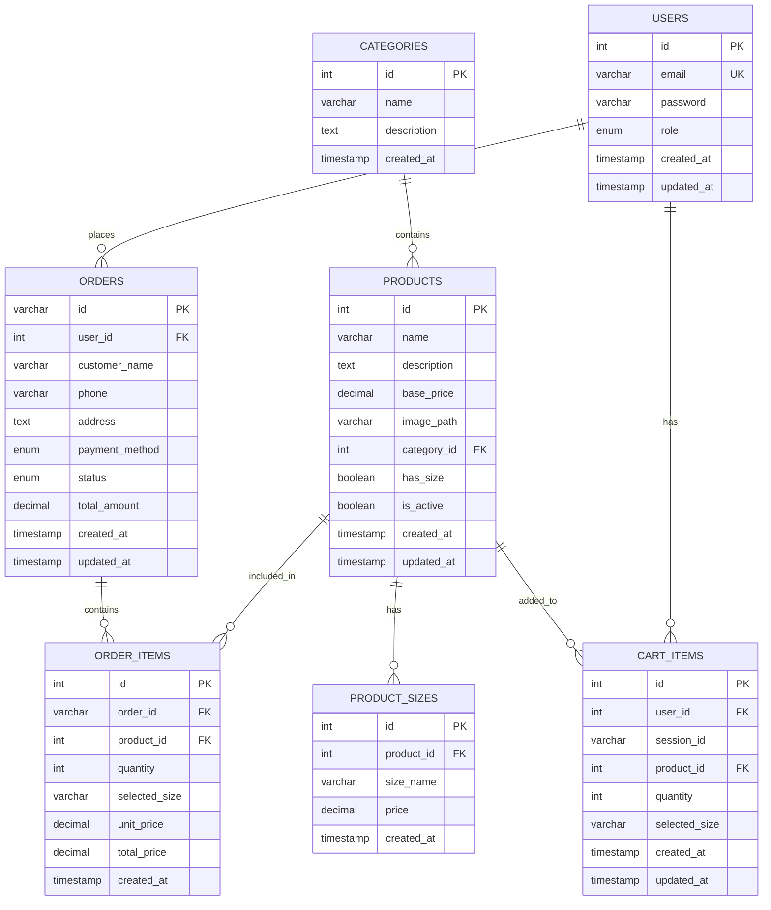

# Sơ đồ ERD - Cafe App Database

## Mô tả
Sơ đồ ERD (Entity Relationship Diagram) cho ứng dụng quản lý cafe, dựa trên cấu trúc dữ liệu từ Flutter project.

## Sơ đồ ERD



## Mô tả các thực thể

### 1. USERS (Người dùng)
- **Mục đích**: Quản lý thông tin người dùng hệ thống
- **Thuộc tính chính**:
  - `id`: Khóa chính, tự tăng
  - `email`: Email đăng nhập (duy nhất)
  - `password`: Mật khẩu đã mã hóa
  - `role`: Vai trò (admin, user, guest)

### 2. CATEGORIES (Danh mục)
- **Mục đích**: Phân loại sản phẩm
- **Thuộc tính chính**:
  - `id`: Khóa chính, tự tăng
  - `name`: Tên danh mục
  - `description`: Mô tả danh mục

### 3. PRODUCTS (Sản phẩm)
- **Mục đích**: Lưu trữ thông tin sản phẩm
- **Thuộc tính chính**:
  - `id`: Khóa chính, tự tăng
  - `name`: Tên sản phẩm
  - `base_price`: Giá cơ bản
  - `has_size`: Có nhiều size không
  - `is_active`: Trạng thái hoạt động

### 4. PRODUCT_SIZES (Giá theo size)
- **Mục đích**: Lưu giá sản phẩm theo từng size
- **Thuộc tính chính**:
  - `product_id`: Khóa ngoại đến PRODUCTS
  - `size_name`: Tên size (S, M, L)
  - `price`: Giá theo size

### 5. ORDERS (Đơn hàng)
- **Mục đích**: Lưu trữ thông tin đơn hàng
- **Thuộc tính chính**:
  - `id`: Khóa chính, chuỗi duy nhất
  - `user_id`: Khóa ngoại đến USERS (có thể NULL cho guest)
  - `status`: Trạng thái đơn hàng
  - `total_amount`: Tổng tiền

### 6. ORDER_ITEMS (Chi tiết đơn hàng)
- **Mục đích**: Lưu chi tiết sản phẩm trong đơn hàng
- **Thuộc tính chính**:
  - `order_id`: Khóa ngoại đến ORDERS
  - `product_id`: Khóa ngoại đến PRODUCTS
  - `quantity`: Số lượng
  - `selected_size`: Size được chọn

### 7. CART_ITEMS (Giỏ hàng)
- **Mục đích**: Lưu trữ tạm thời sản phẩm trong giỏ hàng
- **Thuộc tính chính**:
  - `user_id`: Khóa ngoại đến USERS (có thể NULL cho guest)
  - `session_id`: ID phiên cho guest
  - `product_id`: Khóa ngoại đến PRODUCTS

## Mối quan hệ

1. **USERS → ORDERS**: Một người dùng có thể có nhiều đơn hàng
2. **USERS → CART_ITEMS**: Một người dùng có một giỏ hàng
3. **CATEGORIES → PRODUCTS**: Một danh mục có nhiều sản phẩm
4. **PRODUCTS → PRODUCT_SIZES**: Một sản phẩm có thể có nhiều size
5. **PRODUCTS → ORDER_ITEMS**: Một sản phẩm có thể xuất hiện trong nhiều đơn hàng
6. **PRODUCTS → CART_ITEMS**: Một sản phẩm có thể có trong nhiều giỏ hàng
7. **ORDERS → ORDER_ITEMS**: Một đơn hàng có nhiều chi tiết

## Đặc điểm thiết kế

### 1. Hỗ trợ Guest Users
- `user_id` trong ORDERS và CART_ITEMS có thể NULL
- Sử dụng `session_id` để theo dõi giỏ hàng của guest

### 2. Hệ thống Size linh hoạt
- Bảng PRODUCT_SIZES riêng biệt cho các sản phẩm có size
- Hỗ trợ giá khác nhau cho từng size

### 3. Quản lý trạng thái đơn hàng
- Enum status với 3 trạng thái: pending, confirmed, completed
- Tự động cập nhật total_amount qua triggers

### 4. Tối ưu hiệu suất
- Indexes trên các trường thường xuyên truy vấn
- Views để đơn giản hóa các truy vấn phức tạp

## Views và Stored Procedures

### Views quan trọng:
- `order_details`: Thông tin đơn hàng đầy đủ
- `product_with_sizes`: Sản phẩm kèm giá size
- `order_statistics`: Thống kê đơn hàng

### Stored Procedures:
- `CreateOrder`: Tạo đơn hàng từ giỏ hàng
- Triggers tự động cập nhật total_amount

## Queries mẫu

### 1. Lấy đơn hàng theo trạng thái
```sql
SELECT * FROM orders WHERE status = 'pending';
```

### 2. Thống kê doanh thu
```sql
SELECT 
    DATE(created_at) as date,
    COUNT(*) as orders_count,
    SUM(total_amount) as revenue
FROM orders
WHERE status = 'completed'
GROUP BY DATE(created_at);
```

### 3. Sản phẩm bán chạy
```sql
SELECT 
    p.name,
    SUM(oi.quantity) as total_sold
FROM products p
JOIN order_items oi ON p.id = oi.product_id
JOIN orders o ON oi.order_id = o.id
WHERE o.status = 'completed'
GROUP BY p.id, p.name
ORDER BY total_sold DESC;
```
